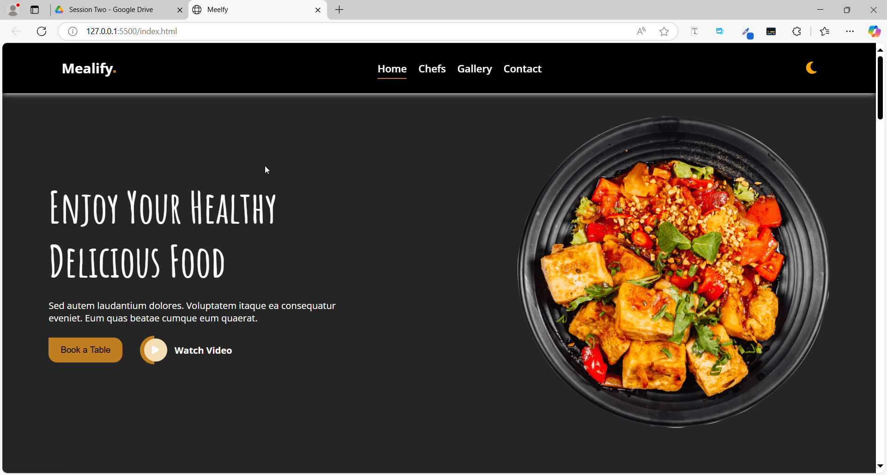

# Mealify Website

A simple personal portfolio website built using **HTML** and **CSS (Flexbox)** only.  
This project is part of my ongoing Full Stack training at Rout Academy, and it focuses on modern layout techniques.

## 🎯 What I learned:

’ve just completed Task 4 of Week 5 in Route Academy training, using CSS Variables and Flexbox.

🔹 We used Flexbox to build smooth, responsive layouts with full control over spacing, direction, and alignment – both vertically and horizontally.

One of the smartest tricks we applied in this task:
✅ Creating a Dark Mode and Light Mode toggle using only CSS –
No JavaScript, no events – just by linking styles to the checkbox state and using :checked with CSS variables to switch themes dynamically.

The whole project is built with just HTML and CSS, showing how much can be achieved with the right techniques and creativity.

## 💡 Tools used:

- HTML5
- CSS3 (Flexbox)

## 📸 Preview:

